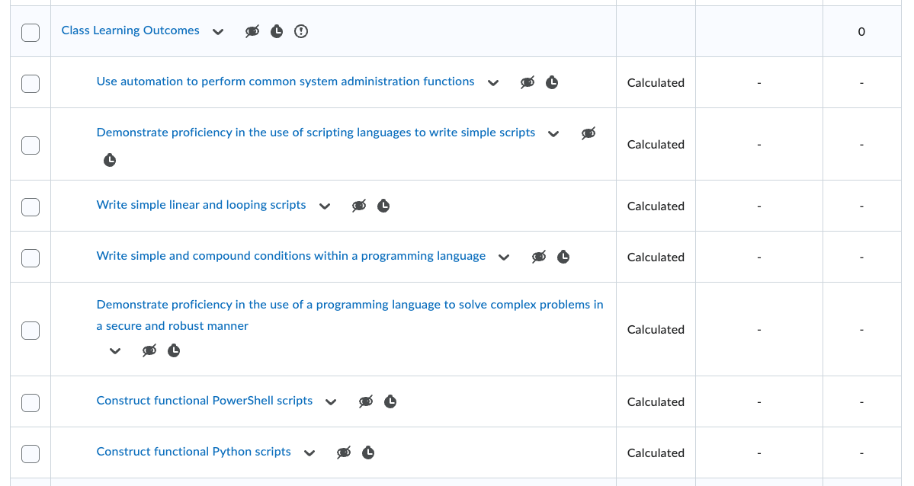
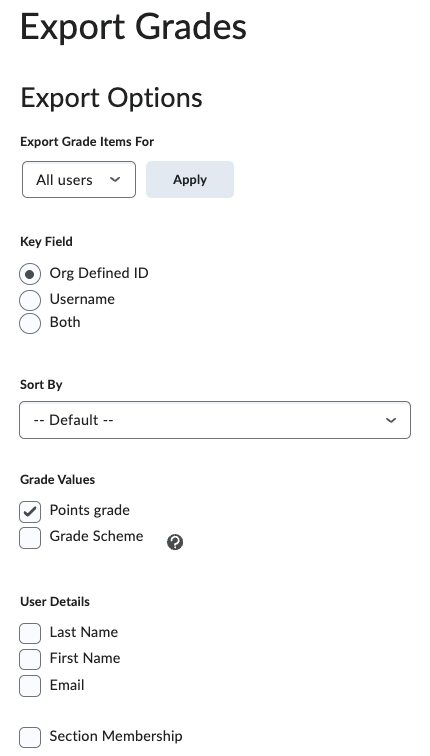

# Configuring D2L for CLO-Based Grading

This guide explains how to configure a D2L course shell so that grades can be exported in a format that `closer` can process for eLumen CLO assessment purposes.

`closer` assumes that **each Course Learning Outcome (CLO) is represented by a calculated grade item in D2L**. If this configuration is not in place, the exported grading file will not be usable.

---

## Prerequisites

Before starting:

- You have instructor access to the D2L course shell
- The course CLOs are defined in the syllabus
- All graded activities (assignments, quizzes, etc.) already exist in D2L

---

## Step 1: Create a CLO Grading Category

1. In D2L, navigate to **Grades → Manage Grades**.
2. Create a new **grade category** named something like:
   - `Class Learning Outcomes`
3. Configure the category as follows:
   - **Exclude from final grade calculation**
   - **Hidden from users**

This category will exist solely to hold calculated CLO grade items and should not affect students’ final grades or be visible to them.

> Note: Excluding a grade category from the final grade calculation **automatically excludes all grade items within that category** from the final grade.  
>  
> However, **hiding a category does not automatically hide the individual grade items** it contains. Each CLO grade item must be explicitly hidden.

---

## Step 2: Create One Calculated Grade Item per CLO

Within the CLO grading category, create one grade item for each CLO listed in the syllabus.

For each CLO grade item:

1. Choose **Calculated** as the grade item type.
2. Name the grade item clearly (for example):
   - `CLO 1 – Ethical Reasoning`
   - `CLO 2 – Legal Analysis`
3. Configure the grade item:
   - **Hidden from users**
4. Define the calculation formula so that the grade item aggregates the underlying assignments, quizzes, or discussions that assess that CLO.

Each CLO grade item should reflect a student’s overall performance on that specific outcome, based on the relevant graded work.

> Tip: A CLO grade item should not reference *all* assignments—only those that meaningfully assess that outcome.

After creating the CLO grade items, your gradebook should show **one calculated grade item per CLO**, all grouped under the CLO category.

*Each CLO appears as a calculated grade item within the “Class Learning Outcomes” category. All items are hidden from students and excluded from final grade calculations.*

---
## Step 3: Configure Export Options Carefully

When exporting grades from D2L, it is critical to include **only the information required for CLO assessment**. Additional fields or alternate formats will cause `closer` to misinterpret the CSV file.

Before exporting, confirm the following export options:

- **Export Grade Items For:** All users
- **Key Field:** Org Defined ID
- **Grade Values:** Points grade (checked)
- **Grade Scheme:** Not checked
- **User Details:** None selected (Last Name, First Name, Email unchecked)
- **Section Membership:** Not selected

*Only numeric CLO grade values and a single student identifier should be included. Do not include names, email addresses, grade schemes, or section data.*

> ⚠️ Including additional fields (such as student names or grade schemes) will change the column layout of the CSV file and prevent `closer` from processing it correctly.

---

## Step 4: Export CLO Grades from D2L

Once all CLO grade items are configured:

1. Navigate to **Grades → Enter Grades**.
2. Choose **Export**.
3. When selecting grade items to export:
   - **Select only the CLO calculated grade items**
   - Do not include individual assignments or quizzes
4. Export the grades as a **CSV file**.

The resulting CSV file will contain one column per CLO and one row per student. This file is the input that `closer` expects.

---

## Expected Result

After completing these steps:

- Each CLO has a corresponding calculated grade item in D2L
- CLO grades do not affect students’ final course grades
- CLO grades are hidden from students
- The exported CSV contains only CLO grade columns
- The CSV file can be processed directly by `closer`

---
## Next Step

Proceed to the usage guide:

➡️ [Using closer to Convert D2L CLO Exports](./using-closer.md)
